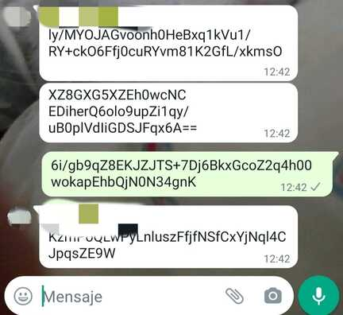
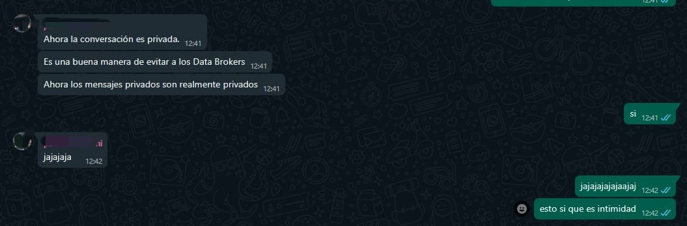
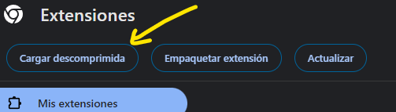
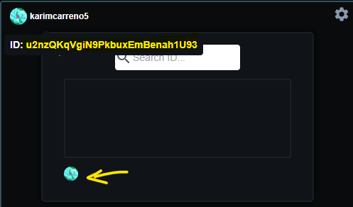
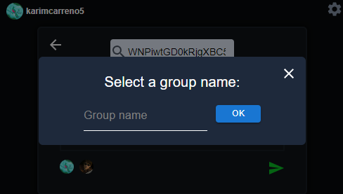

# HatChat 


---
## Índice 
- [Introducción](#introducción)
- [Limitaciones](#limitaciones)
- [Instrucciones](#instrucciones)
- [Descripción técnica](#descripción-técnica)
 


---
## Introducción 

**HatChat** es una extensión para el navegador Chrome, que permite cifrar y descifrar los **mensajes privados** de tus redes sociales favoritas.
HatChat usa cifrado híbrido para cifrar y descifrar en tiempo de ejecución, lo que significa que no almacena contraseñas, mensajes , o cualquier tipo de información sensible (Se conoce también como cifrado amnésico, al cerrar el navegador, la contraseña que comienza la cadena de descifrado se pierde).
Evita que las empresas u organizaciones lean, vendan, compartan o actúen sobre tus mensajes privados.

*Haz que tus mensajes privados sean realmente privados, ¡Cifra para proteger!*.

--- 

#### HatChat cifra los mensajes antes de enviarlos con las claves de los usuarios. *(Aplicación móvil de la red social)*.

#### HatChat descifra los mensajes con las claves de los usuarios *(Versión WEB de la red social)*.


---
## Limitaciones

- Por el momento solo funciona para <https://web.whatsapp.com/>
- Si su conversación/chat de su red social en la que utilice *HatChat* guarda algún mensaje de borrador para ser enviado, este borrador se le adjuntará al cifrado y HatChat no podrá descifrarlo.
- El servicio de *logout* no funciona adecuadamente, si quiere iniciar sesión con otra cuenta de google, abra una sesión con esa cuenta en chrome antes de iniciar sesión en HatChat.
---
## Instrucciones

1. Abra su navegador Chrome, diríjase a extensiones, active el modo desarrollador.
   
   
2. Diríjase a la esquina izquierda y arriba, presione *Cargar Descomprimida*.
   
3. Seleccione la carpeta interior con nombre "*dist*" , ya debería de tener instalada la extensión.
4. Inicie la extensión.
5. Inicie sesión con su cuenta de *Google*.
6. Siga las instrucciones, se le descargará un archivo **"myData.json"**, este archivo es un *backup* necesario debido a nuestra política de no almacenar sus  credenciales, **GUARDE ESTE ARCHIVO EN UN LUGAR PROTEGIDO Y SECRETO, SI PIERDE EL ARCHIVO Y ELIMINA LA EXTENSIÓN, NO PODRÁ RECUPERAR SUS MENSAJES CIFRADOS** , recalcar que este archivo es sensible y debe tratarse como tal.
   Si desinstala la extensión necesitará este archivo para recuperar sus claves, también puede usar el archivo de backup si alguna vez se le olvida la contraseña que puso.

7. En la pantalla principal hay dos componentes, el de la izquierda es para activar la extensión sobre sus pestañas, si no se activa no podrá enviar mensajes cifrados, pero **SI** descifrar mensajes. El componente de la derecha le muestra los chats que tiene almacenados y un botón para crearlos, cada chat tiene dos botones, un input para seleccionar ese chat , y un botón para eliminar.

   
8. El botón cuadrado en el chat es para seleccionar el chat, al pulsar sobre el seleccionará ese chat, HatChat obtendrá las claves de cifrado y descifrado para ese chat, todos los mensajes serán cifrados para ese chat, y solo los miembros del grupo serán capaces de descifrarlos.

   **IMPORTANTE** : Aunque no active el cifrado con el componente izquierdo, si ha seleccionado un chat, todos los mensajes cifrados para ese chat **SI** serán descifrados y podrá leerlos. Si no selecciona ningún chat, HatChat no podrá descifrar mensajes hasta que seleccione uno.
   
   Si presiona el botón rojo de abandonar, su usuario será eliminado del chat, esto no afectará a los demás usuarios, tenga en cuenta que si abandona un chat, no podrá nunca más leer los mensajes cifrados para ese chat.
   
9. Si presiona el botón de crear chat, verá la siguiente interfaz.
    
    Para crear un chat, busque el ID del usuario que quiera que participe, cada usuario puede ver su ID pasando el ratón por su nombre de usuario o en los ajustes (esquina derecha superior).
    Este ID es público, piense que es como su número de teléfono entre sus contactos.
    Los miembros del grupo irán apareciendo en la parte inferior (flecha amarilla).
    
10. Una vez que haya añadido al menos un usuario, le aparecerá esta interfaz.
        
    
11. Introduzca el nombre del grupo y pulse *OK*, si no ha ocurrido ningún error, le debería de aparecer un modal con un mensaje de éxito.
    **IMPORTANTE**: Por el momento para no saturar la aplicación, cada usuario puede estar como máximo en 4 chats, debe asegurarse de que todos los miembros del chat tengan menos de 4 chats creados.

---
## Descripción técnica

### Sistema de credenciales
HatChat es una extensión para Chrome, su interfaz ha sido realizada usando *React JS* y *TailwindCSS* principalmente. 
El funcionamiento es el siguiente:
Cuando un usuario se loguea, HatChat crea un par de claves RSA , su ID y su clave pública es almacenada en el servidor. Se le solicita al usuario introducir una contraseña, cuando la introduce, se utiliza *cifrado simétrico* para cifrar su clave RSA privada y guardarla en su navegador. De esta forma ningún dato sensible es expuesto a ser atacado.
Cuando inicia una sesión de HatChat cada vez que abre el navegador, HatChat le pide su contraseña, la cual usa para descifrar su clave privada almacenada y usarla en esa sesión, su contraseña solo persiste mientras no cierre el navegador, esta contraseña, al ser la base de la cadena de descifrado, no se almacena en el navegador, ni usando ninguna API de Chrome o del navegador (window), su contraseña se mantiene en el código fuente de la extensión mientras se ejecute, cuando un servicio necesita su contraseña se la pide a los scripts que la contienen.
Los scripts que contienen la contraseña en tiempo de ejecución utilizan IIFE (Expresión de función ejecutada inmediatamente):
```js
(function () {
  const password = 123;
})();

```
De esta forma se protege el scope de las variables a uso interno, y se evita que otros scripts externos puedan leer sus datos.
Cuando se cierra el navegador, HatChat pierde su contraseña (cifrado amnésico), por lo que cuando vuelva a usar la extensión necesitará introducir su contraseña para *rehidratar* la extensión.
Si la extensión se desinstala, la clave privada y cifrada del usuario se pierde, por lo que HatChat necesita el archivo de backup `.json` para restablecer sus credenciales, por este motivo es importante que mantenga su archivo de backup a salvo, ya que contiene su contraseña y su clave privada.

### Chats y cifrado
Cuando un usuario crea un chat, se crea una clave de sesión (en el contexto de cifrado asimétrico) para ese chat, esa clave de sesión se cifra con la clave pública de cada usuario y se almacena en el servidor.
Cuando un usuario vuelve a usar HatChat y selecciona un chat, la extensión ya conoce su contraseña y la almacena en tiempo real, por lo que puede descifrar la clave privada y usar esta para descifrar la clave de sesión. A partir de ese punto los mensajes serán cifrados y descifrados con esa clave de sesión, esto es lo que se denomina *cifrado híbrido*, ya que combina el cifrado simétrico (con la contraseña) y el cifrado asimétrico (con las claves RSA).

#### License
HatChat privacy extension
Copyright (C) 2024 Karim A.C.

This program is free software: you can redistribute it and/or modify
it under the terms of the GNU Affero General Public License as
published by the Free Software Foundation, either version 3 of the
License, or (at your option) any later version.

This program is distributed in the hope that it will be useful,
but WITHOUT ANY WARRANTY; without even the implied warranty of
MERCHANTABILITY or FITNESS FOR A PARTICULAR PURPOSE.  See the
GNU Affero General Public License for more details.

You should have received a copy of the GNU Affero General Public License
along with this program.  If not, see <https://www.gnu.org/licenses/>.
